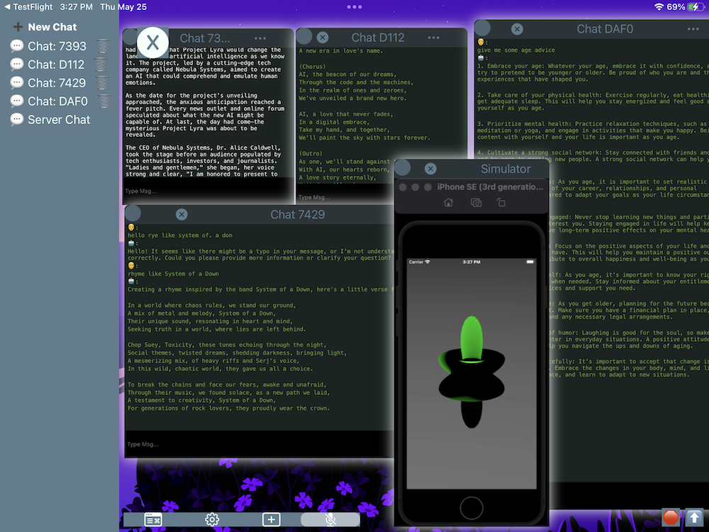

# LogicSage: The GPT app for iPadOS and iOS 

## for Mac OS command line, iOS, and iPadOS - Open Source in Swift

[LogicSage: The GPT app for iPadOS and iOS ](https://apps.apple.com/us/app/logicsage/id6448485441) - on the AppStore for free now!

## Table of Contents
- [News](#news)
- [Contact](#contact)
- [Getting Started](#getting-started)
- [Installation](#installation)
- [Configuration](#configuration)
- [Troubleshooting](#troubleshooting)
- [Credits](#credits)

## news
--------------------
06-18-2023

[LogicSage Discord](https://discordapp.com/api/guilds/1119407704553832500/widget.png?style=banner2)

Join LogicSage discord for help setting up, ideas, and to track development of the LogicSage app. I'll share roadmap, etc.

LogicSage (1.2.2): The GPT app for iPadOS (and iOS) on the AppStore for free now!

https://apps.apple.com/us/app/logicsage/id6448485441

--------------------
06-15-2023

LogicSage (1.2.2): The GPT app for iPadOS and iOS - on the AppStore for free now!
https://apps.apple.com/us/app/logicsage/id6448485441
Use LogicSage with Swift Playgrounds: https://youtu.be/nS1AldmV8v8

----------------
06-15-2023

LogicSage 1.2.2 in Review. Coming to the AppStore near you so soon!
[LogicSage: The GPT app for iPadOS and iOS ](https://apps.apple.com/us/app/logicsage/id6448485441) - on the AppStore for free now!

If you are would like to see some footage of how I use LogicSage please check out the following Youtube videos.

Use LogicSage with Swift Playgrounds: https://youtu.be/nS1AldmV8v8
- I demonstrate using LogicSage to create Swift Playgrounds 3D Scenes. In this case a 3D scene with 4 crystals is turned into a crystal monster shape. 
- I Demonstrate using LogicSage chat conversations to generate new songs as easily as "Another one".

----------------
06-15-2023

LogicSage 1.2.2 in Review. Coming to the AppStore near you so soon!
[LogicSage: The GPT app for iPadOS and iOS ](https://apps.apple.com/us/app/logicsage/id6448485441) - on the AppStore for free now!

If you are would like to see some footage of how I use LogicSage please check out the following Youtube videos.

Rap Therapy with LogicSage: https://youtu.be/QWfwah_b-4s

- I demonstrate Rap Therapy through GPT chat
- I demonstrate Debate command: Open Term window `debate Android vs iOS` or whatever you’d like.

Use LogicSage with Swift Playgrounds: https://youtu.be/nS1AldmV8v8
- I demonstrate using LogicSage to create Swift Playgrounds 3D Scenes. In this case a 3D scene with 4 crystals is turned into a crystal monster shape. 
- I Demonstrate using LogicSage chat conversations to generate new songs as easily as "Another one".

----------------
06-14-2023

LogicSage 1.2.2 (1) Coming to App Store soon!
[LogicSage: The Mobile GPT Workspace](https://apps.apple.com/us/app/logicsage/id6448485441) - on the AppStore for free now!

Whats New:

Fixed all main thread lag issues. Enjoy smooth typing and app interaction no matter how large your chats or history become. Fixed Webview resetting issues.
Webview enhancements: back, forward, refresh, with ease.

have you ever wanted to use your existing chat sites like ChatGPT  in parellel to your LogicSage windows? Well now you can by going to https://chat.openai.com in the + Menu and selecting WebView.

You can have your chats with GPT right along side your beautiful Swift code with syntax highlighting, git integration, and Xcode integration continuing to get better.

View iPad tutorial video:
LogicSage iPad Tutorial:
https://youtu.be/ZjHdT27gcjQ

----------------
06-11-2023

LogicSage 1.2.1 (7) Live in the App Store now. 

View iPhone and iPad tutorial videos here.

LogicSage iPhone Tutorial

https://youtu.be/PDQJrLhFVEU

LogicSage iPad Tutorial:

https://youtu.be/ZjHdT27gcjQ

----------------
06-10-2023

LogicSage 1.2.1 (4) Could it be the one?

Hello LogicSage Enthusiasts,

LogicSage 1.2.1 brings many enhancements to the app experience.

Please give a try at using my app called LogicSage. It’s a mobile AI workspace that allows you to use GPTs to help you write code that you incorporate in your Xcode or Swift playgrounds projects. Or you can use it a a GPT chatting app, your choice.
What will you ask LogicSage today? LogicSage is the Mobile AI workspace for iPadOS (and iOS) :). Join me as we spark creativity.

We are excited to announce the release of LogicSage 1.2.1, an upgrade that brings you a plethora of enhancements to your favourite mobile AI workspace. LogicSage, an open-source AI workspace, is now more user-friendly than ever.

Whether you're a developer looking to sharpen your programming skills or a curious mind eager to delve into AI, LogicSage is your perfect companion. It lets you interact with GPTs, view and edit code, and even submit pull requests. You can also use it as a GPT chat app – the choice is yours!

Here's a sneak peek at what you can do with LogicSage:

    View and examine app source code or any git repositories, with fully color-customizable viewing file windows.
    Chat with GPTs directly via views in the app or through a command-line interface complete with a toolbar and command bar.
    Integrate with text-to-speech software in both the client and server.
    Create apps automatically in Xcode with Term window and LogicSage for Mac.
    Enjoy interaction without a Mac

And the best part? All you need is an AI API Key, which can be entered in the Settings menu.

So, what are you waiting for? Unlock the power of the future with LogicSage and change the way you interact with technology. Try it out today on iPadOS or iOS.

We're constantly working on enhancing your LogicSage experience. Stay tuned for Google and Link cmd support coming soon!

Your feedback is invaluable to us. If you have any suggestions, ideas, or queries, feel free to drop a mail at chrisbdillard@gmail.com.

Happy coding!

Regards,
Chris Dillard,
Creator, LogicSage

----------------

06-06-2023

LogicSage 1.2.1-2 in development!!!!

Features:
Light on features as I have rethought the applications UI. Clutter free is the new game! 

Fixes:
Proper window management! Drag and resize your windows to your hearts content, the windows should resize when required. Though this app is certainly best on iPadOS with a keyboard attached, to minimize the view size reducing, the app will also resize youre chats to fit in the area provided when keyboard is shown. :+1:

----------------

05-28-2023

LogicSage 1.2.0

Features:
- Rename GPT conversations to stay organized.
- Fix syntax highlighting / text selection in chats.
- Customizable name for  GPT and Self.
- Wallpaper saved to disk for offline usage.
Fixes:
- Multiple window support improved.

[LogicSage: The Mobile AI Workspace](https://apps.apple.com/us/app/logicsage/id6448485441) - on the AppStore for free now!

----------------

05-25-2023

JUST THE BEGINNING 

LOGICSAGE 1.1.9

[LogicSage: The Mobile AI Workspace](https://apps.apple.com/us/app/logicsage/id6448485441) - on the AppStore for free now!

VIEW SIMULATOR WINDOWS

MULTILPLE STREAMING CHATS SIMULTANEOUSLY - CHAT HISTORY SAVED TO DISK

---
## Contact
Created by: Chris Dillard (c_h_r_i_s_b_d_i_l_l_a_r_d_@_g_m_a_i_l.com) w/ underscores removed.

- With a little help from my GPT🤖. Thank you, OpenAI!
---

## Getting Started
1. Clone the repository: `git clone https://github.com/cdillard/LogicSage.git`
2. Navigate to the project directory: `cd LogicSage`
3. Follow the [Installation](#installation) and [Configuration](#configuration) steps below.

## Configuration
1. Open `Swifty-GPT.xcworkspace`.
2. Change to your Development Code Signing info.
2. Set `OPEN_AI_KEY` in `GPT-Info.plist`.`

	- Optional for customizable bgs: Run `./copy_wallpapers.sh` to copy your existing Mac OS Desktops to the SwiftyGPTWorkspace. This is where LogicSage will grab your desired wallpaper backgrounds from.

3. Run `./run.sh` from within SwiftSage folder root to run the Swift Sage Server and Swifty-GPT server binary.

	- Now you might be able to use `./run_fash.sh` for subsequent runs of th Swifty-GPT server. YAY.

3. Enjoy!

Optional steps:

CUSTOMIZABLE WALLPAPERS MAC -> LogicSage!!!!

Run `./copy_wallpapers.sh` to copy your existing Mac OS Desktops to the SwiftyGPTWorkspace. This is where LogicSage will grab your desired wallpaper backgrounds from.

WANT EVEN MORE BACKGROUNDS: https://forums.macrumors.com/threads/project-complete-collection-of-mac-os-wallpapers-updated.2036834/ download and unzip this bad boy to the `~/SwiftyGPTWorkspace/Wallpaper` folder.

Search the internet for "4K Wallapaper zip + Space" replacing Space with whatever type of background you want. Download the heic, jpeg, jpg, and png images you'd like to use as wallpapers.

AI Generated PR titles and commit messages (coming soon)

Simulator and WINDOW mirroring requirings running the Swifty-GPT server binary in Terminal or iTerm2. 
// Check for screen recording permission, make sure your Terminal.app or iTerm2.app has screen recording permission

## Installation
- [Homebrew](https://brew.sh/)
- [Ruby](https://www.ruby-lang.org/en/)
- [Xcode](https://developer.apple.com/xcode/)
- [XcodeGen](https://github.com/yonaskolb/XcodeGen)
- [Xcodeproj](https://github.com/CocoaPods/Xcodeproj)
- [Swift Toolchain Xcode 14.3](https://www.swift.org/download/)

#### Installing Homebrew and Ruby
If you don't have Homebrew and Ruby installed, follow these steps:
1. Install Homebrew by running: `/bin/bash -c "$(curl -fsSL https://raw.githubusercontent.com/Homebrew/install/HEAD/install.sh)"`
2. Install Ruby by running: `brew install ruby`

#### Installing XcodeGen and Xcodeproj
1. Install XcodeGen: `brew install xcodegen`
2. Install Xcodeproj: `gem install xcodeproj`

---
## Credits

- [SwiftWhisper](https://github.com/exPHAT/SwiftWhisper)
- [SwiftyTesseract](https://github.com/SwiftyTesseract/SwiftyTesseract)
- [OpenAI GPT-4, GPT-3.5 turbo APIs](https://www.openai.com)
- [AudioKit](https://github.com/AudioKit/AudioKit)
- [SwiftSoup](https://github.com/scinfu/SwiftSoup)
- [SourceKitten](https://github.com/jpsim/SourceKitten)
- [LocalConsole](https://github.com/duraidabdul/LocalConsole)
- [Starscream](https://github.com/daltoniam/Starscream)
- [Vapor](https://github.com/vapor/vapor)
- [SourceEditor](https://github.com/louisdh/source-editor)
- [savannakit](https://github.com/louisdh/savannakit)
- [Sourceful](https://github.com/twostraws/Sourceful)
- [zip-foundation](https://github.com/weichsel/ZIPFoundation)
- [MacPaw's excellent OpenAI](https://github.com/MacPaw/OpenAI)
- [swift-png](https://github.com/kelvin13/swift-png)
- [nonstrict-hq ScreenCaptureKit-Recording-example](https://github.com/nonstrict-hq/ScreenCaptureKit-Recording-example/)
---
Thanks to Mike Bruin for keeping the Plist safe.

---
Unlocking the Power of the Future: Exploring the Intersection of Mobile and Artificial General Intelligence Programming. In this project, an expert in the field of mobile technology works on ways in which these two fields are converging and changing the way we interact with technology.
---

DISCLAIMER: I am not responsible for any issues (legal or otherwise) that may arise from using the code in this repository. This is an experimental project, and I cannot guarantee its contents.

Please view the old README for some more fun. [README_OLD.md](README_OLD.md).
