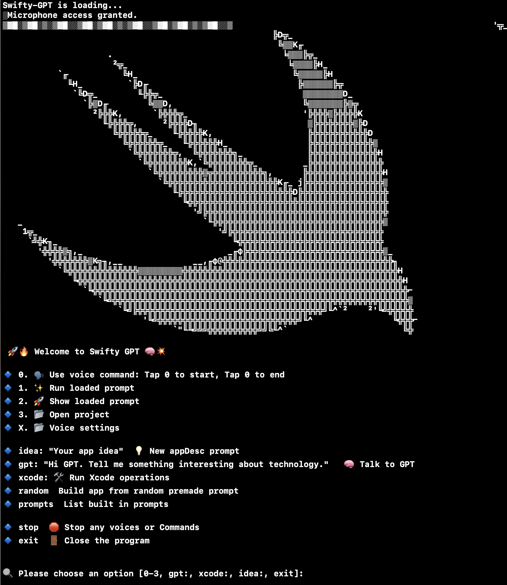

Join me on [Discord](https://discord.gg/6hbDDqf8SX), or not.

## Created by: Chris Dillard (c_h_r_i_s_b_d_i_l_l_a_r_d_@_g_m_a_i_l.com)

- With a little help from my GPT🤖. Thank you Open AI.

# Swifty-GPT is a great tool for creating apps on Apple devices like iPhones, Macs, and more. It helps with everything in Xcode, from starting projects to fixing bugs. Plus, it can do a lot of the work for you, like adding the right code, so you can focus on making your app amazing. Whether you're developing a fun game or a professional business app, Swifty-GPT makes the whole process smoother and easier in Xcode.

# Instructions: Open Swifty-GPT.xcworkspace, Set OPEN_AI_KEY. Have fun!

1. OCR models you need:

https://github.com/tesseract-ocr/tessdata_fast

https://github.com/tesseract-ocr/tessdata

https://github.com/tesseract-ocr/tessdata_best

Put the testdata_fast directory contents into  ../SwiftyGPTWorkspace/tessdata_fast-main

2. For Voice Command you must download dataset you desire to use from https://huggingface.co/ggerganov/whisper.cpp/tree/main.
youll need
 ggml-large.bin,
 ggml-medium.en.bin,
 ggml-large-v1.bin,
 ggml-base.en.bin,
 ggml-small.en.bn,

Put them folders in Swifty-GPT/Swifty-GPT/Model

IF you ever have robot voices getting away from you, `killall say` in the terminal will stop them.

# Voice Command

Pick your voice after trying them out with voice_test `swift voice_test.swift` inside Swifty-GPT folder.

 # Troubleshoot

Run `export DISPLAY=:0`

Run app XQuartz

 If you are seeing "would like to use your Microphone", "Would like to send events to other applications" dialogs, please blindly accept them.

 # Thesis
The Ultimate AI Integration for Xcode: Where GPT Can Hear You and See Your Code!

Are you tired of spending hours writing code and debugging errors? Do you wish you had a tool that could automate nearly all tasks in Xcode? Look no further than our AI integration, the ultimate solution for software developers!

Overview

AI integration is a marvel of technology, capable of analyzing code and suggesting optimizations, detecting errors and automatically fixing them, and even generating new code based on user input. But that's not all! Our integration has a revolutionary new feature: the ability for GPT to HEAR you and SEE your code.

Our AI integration also utilizes a consciousness module to store past memories from coding sessions, including all the text from open Xcode windows and context based on conversation in natural language with the Swift or Apple device developer. This allows our integration to become even more personalized to each individual user, and can greatly improve efficiency and accuracy.

Features

Our AI integration includes a wide range of features to make software development faster and more efficient. Here are just a few of the highlights:

Code analysis and optimization
Error detection and correction
Voice-activated GPT integration
Real-time code suggestions
Powerful debugging tool
Integration with Apple's built-in text-to-speech software
Personalized memory storage using a consciousness module

Challenges and Solutions

As AI becomes more possible we'll face challenges the sheer amount of data is overwhelming!

Conclusion

In the end, I hope this AI integration helps this level of AI integration became the gold standard for software development, used by companies all over the world to write code faster and more efficiently than ever before. Our integration had truly changed the world of software development, where GPT can HEAR you and SEE your code!

iPad and iOS support coming soon!

# Credits
SwiftWhisper: https://github.com/exPHAT/SwiftWhisper

SwiftyTessarect: https://github.com/SwiftyTesseract/SwiftyTesseract 

OpenAI GPT-4, GPT-3.5 turbo APIs: www.openai.com 

AudioKit:  https://github.com/AudioKit/AudioKit