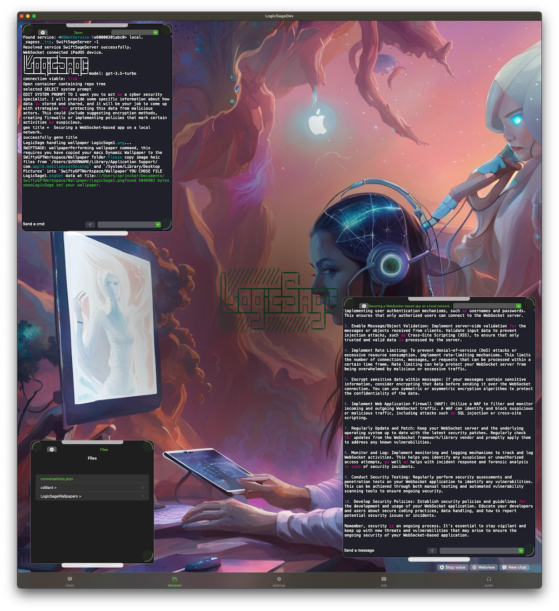

# LogicSage: The GPT app for Apple platforms. (iPadOS, MacOS, and iOS) 

[LogicSage: The GPT app for Apple platforms. (iPadOS, MacOS, iOS and more platforms soon!)](https://apps.apple.com/us/app/logicsage/id6448485441) - on the AppStore for free now!

# LogicSage 1.2.4 (latest release)
### What's New:
- Automatically name convo after receiving AI response for better organization.
- Easier window movement with handlebar.
- Built in system prompts set the right stage for the conversation.
- Improved Chat Interface. Perfected Keyboard Handling

## Table of Contents
- [Getting Started](#getting-started)
- [Installation](#installation)
- [Configuration](#configuration)
- [Contact](#contact)
- [Credits](#credits)

## Getting Started with LogicSage: iOS, iPadOS, MacOS
0. Download LogicSage from the AppStore.[link](https://apps.apple.com/us/app/logicsage/id6448485441)
0. LogicSage is a 'Bring Your Own API Key' app. Before you can start chatting, you need to enter an OpenAI API Key (https://platform.openai.com/account/api-keys) in the apps UI. 
    - it will be stored securely in your devices keychain. It will only be used when sending request to Open AI server (Check the source code to verify this fact if you want).

Optional steps:

If you'd like to use LogicSage for Mac:
	- Using LogicSage for Mac allows to open / build AI geneaterated Xcode projects on your Mac.

0. Go to the root of your MacOS user directory (~)
	- `cd ~`
1. Clone the repository: `git clone https://github.com/cdillard/LogicSage.git`
	- You should now have the repository checked out in `~/LogicSage/`
2. Open `~/LogicSage/` in Finder.
3. Open `Swifty-GPT.xcworkspace` by double clicking it.
4. Set `OPEN_AI_KEY` in `GPT-Info.plist`.`

	- Optional for customizable bgs: Run `./copy_wallpapers.sh` to copy your existing Mac OS Desktops to the LogicSageWorkspace. This is where LogicSage will grab your desired wallpaper backgrounds from.

5. Run LogicSage.app

CUSTOMIZABLE WALLPAPERS MAC -> LogicSage!!!!

Run `./copy_wallpapers.sh` to copy your existing Mac OS Desktops to the SwiftyGPTWorkspace. This is where LogicSage will grab your desired wallpaper backgrounds from.

WANT EVEN MORE BACKGROUNDS: https://forums.macrumors.com/threads/project-complete-collection-of-mac-os-wallpapers-updated.2036834/ download and unzip this bad boy to the `~/LogicSageWorkspace/Wallpaper` folder.

Search the internet for "4K Wallapaper zip + Space" replacing Space with whatever type of background you want. Download the heic, jpeg, jpg, and png images you'd like to use as wallpapers.

// For iOS Simulator viewing, Check for screen recording permission, make sure your Terminal.app or iTerm2.app has screen recording permission

## Installation
- [Homebrew](https://brew.sh/)
- [Ruby](https://www.ruby-lang.org/en/)
- [Xcode](https://developer.apple.com/xcode/)
- [XcodeGen](https://github.com/yonaskolb/XcodeGen)
- [Xcodeproj](https://github.com/CocoaPods/Xcodeproj)
- [Swift Toolchain Xcode 14.3](https://www.swift.org/download/)

#### Installing Homebrew and Ruby
If you don't have Homebrew and Ruby installed, follow these steps:
1. Install Homebrew by running: `/bin/bash -c "$(curl -fsSL https://raw.githubusercontent.com/Homebrew/install/HEAD/install.sh)"`
2. Install Ruby by running: `brew install ruby`

#### Installing XcodeGen and Xcodeproj
1. Install XcodeGen: `brew install xcodegen`
2. Install Xcodeproj: `gem install xcodeproj`

---
## Disclaimer
I am not responsible for any issues (legal or otherwise) that may arise from using the code in this repository. This is an experimental project, and I cannot guarantee its contents.

## Token Usage Warning
Please be aware that this tool could generate many requests to the OpenAI API. This can use up a lot of tokens. Consider this aspect before using the tool extensively. OpenAI and the creators of this tool accept no responsibility for any damages or losses that may occur.

---

## Contact
Created by: Chris Dillard (chrisbdillard@gmail.com)

- With a little help from my GPT🤖. Thank you, OpenAI!

---
## Credits

- [SwiftWhisper](https://github.com/exPHAT/SwiftWhisper)
- [SwiftyTesseract](https://github.com/SwiftyTesseract/SwiftyTesseract)
- [OpenAI GPT-4, GPT-3.5 turbo APIs](https://www.openai.com)
- [AudioKit](https://github.com/AudioKit/AudioKit)
- [SwiftSoup](https://github.com/scinfu/SwiftSoup)
- [SourceKitten](https://github.com/jpsim/SourceKitten)
- [Starscream](https://github.com/daltoniam/Starscream)
- [Vapor](https://github.com/vapor/vapor)
- [SourceEditor](https://github.com/louisdh/source-editor)
- [savannakit](https://github.com/louisdh/savannakit)
- [Sourceful](https://github.com/twostraws/Sourceful)
- [zip-foundation](https://github.com/weichsel/ZIPFoundation)
- [MacPaw's excellent OpenAI](https://github.com/MacPaw/OpenAI)
- [swift-png](https://github.com/kelvin13/swift-png)
- [nonstrict-hq ScreenCaptureKit-Recording-example](https://github.com/nonstrict-hq/ScreenCaptureKit-Recording-example/)
- [KeyboardAvoidanceSwiftUI](https://github.com/V8tr/KeyboardAvoidanceSwiftUI)
- [awesome-chatgpt-prompts](https://github.com/f/awesome-chatgpt-prompts)
- [Tikitoken](https://github.com/aespinilla/Tiktoken)
- [XcodeProj](https://github.com/tuist/XcodeProj)
---
Thanks to Mike Bruin for keeping the Plist safe.

---
Unlocking the Power of the Future: Exploring the Intersection of Mobile and Artificial General Intelligence Programming. In this project, an expert in the field of mobile technology works on ways in which these two fields are converging and changing the way we interact with technology.