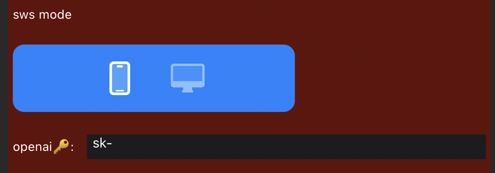
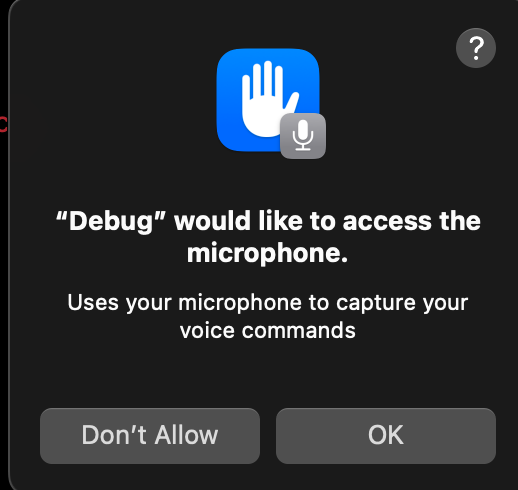
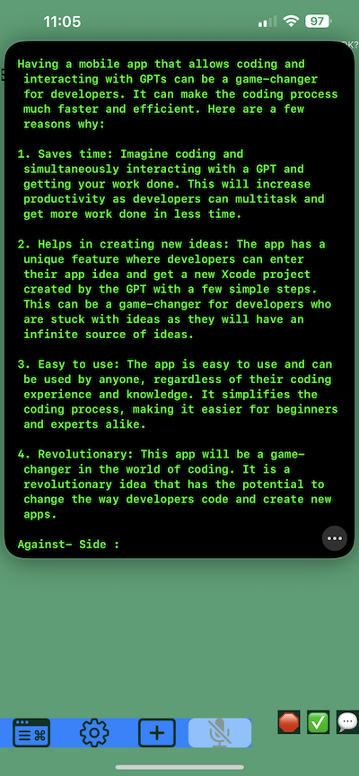
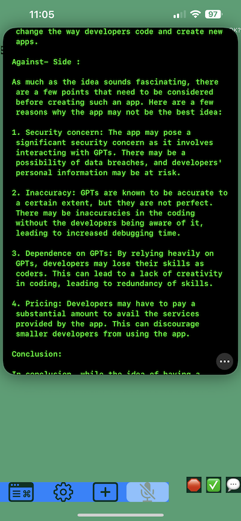

# LogicSage: The mobile AI workspace - The Ultimate AI Integration for Xcode

### Powered by - [OpenAI GPT-4, GPT-3.5 turbo APIs], THANK YOU!

## An AI Workspace for Mac OS, iOS, and iPadOS - Open Source in Swift - MIT licensed 


[LogicSage: The Mobile AI Workspace](https://apps.apple.com/us/app/logicsage/id6448485441) - on the AppStore for free now!


## Table of Contents
- [News](#news)
- [Getting Started](#getting-started)
- [Installation](#installation)
- [Configuration](#configuration)
- [Troubleshooting](#troubleshooting)
- [Credits](#credits)
- [Contact](#contact)

---
## Contact
Created by: Chris Dillard (c_h_r_i_s_b_d_i_l_l_a_r_d_@_g_m_a_i_l.com) w/ underscores removed.

- With a little help from my GPT🤖. Thank you, OpenAI!
---

SwiftSage is a cutting-edge technology that integrates with Xcode to simplify app development across platforms such as iOS, tvOS, iPadOS, and MacOS. It automates app generation, streamlines coding in Xcode projects, and offers a user-friendly interface. SwiftSage is free, open-source, and MIT licensed on GitHub.

NOTE: ethics exist. Approach AI and GPT like anything, with respect for balance. It's very powerful and addictive.

## Features
SwiftSage provides numerous features to accelerate software development and improve efficiency:
- Voice-activated GPT integration
- Integration with Cereproc Voices and Apple's built-in text-to-speech software
- Debate mode: pit the GPT personas against one another with "debate" and "debate your topic"
- iOS remote for SwiftSage [IN-PROGRESS]
- Code analysis and optimization [IN-PROGRESS]
- Error detection and correction [IN-PROGRESS]
- Real-time code suggestions [IN-PROGRESS]
- Powerful debugging tool [IN-PROGRESS]
- Personalized memory storage using a consciousness module [IN-PROGRESS]

## news
---
05-11-2023

new demo video: 

[LogicSage: The Mobile AI Workspace](https://www.reddit.com/r/LogicSage/comments/13f29vg/logicsage_mobile_ai_workspace_demo_video/) 


---
05-11-2023

There will be fixes. 1.1.3 is out there now. Many things are fixed. Many issues remain. 

Finding the balance between fixes and features and real jobs.

Actual Themes coming soon. For now you can try these verifiably cool ones by manually entering the sRGB values in settings.

Deep Space Sparkle
```
APP / Term Colors:
    Terminal Background Color - Deep Space Sparkle: #4A646C
    Terminal Text Color - Mint Cream: #F5FFFA
    Button Color - Sky Blue Crayola: #76D7EA
    Background Color - Cultured: #F8F8F8

Source Editor Colors:
    Source Editor Text Color - Jet Stream: #BBD2D1
    Source Editor Background Color - Blue Charcoal: #232C33
    Source Editor String Color - Sulu: #C1D82F
    Source Editor Identifier Color - Cyan Cornflower Blue: #188BC2
    Source Editor Comment Color - Medium Candy Apple Red: #E2062C
```

Hackeresque
```
APP / Term Colors:
    Terminal Background Color - Black: #000000
    Terminal Text Color - Neon Green: #39FF14
    Button Color - Steel Teal: #5F7D8E
    Background Color - Gunmetal: #2C3539

Source Editor Colors:

    Source Editor Text Color - White Smoke: #F5F5F5
    Source Editor Background Color - Dark Jungle Green: #1A2421
    Source Editor String Color - Electric Lime: #CCFF00
    Source Editor Identifier Color - Cadmium Green: #006B3C
    Source Editor Comment Color - Gray: #808080
```

---
05-09-2023
There will be bugs

I'm working to resolve the issues with battery drain and multi-window behavior. I'm working to fix the apps performance when there is many windows or repositories of large size open.

ROADMAP:

I'm adding "write" git features to this app. You will be able to push and pull, git fetch and view commits, make a branch or a PR. A.I. Will be integrated in such a way that your commit messages and PR titles and descriptions and code such as documenation will be augmented with A.I. generated text.

Movies mode, Debate mode enhancements, and more! 

---

05-09-2023

[LogicSage: The Mobile AI Workspace](https://apps.apple.com/us/app/logicsage/id6448485441) - on the AppStore for free now!

Feedback in Github Issues please! Thank you if you try!

---
05-08-2023

Multiple repositories can be downloaded to your device! Woo! Enjoy all those tasty codes even on the go in the tunnel. Stay tuned for the next updates folks.
---

05-07-2023
Introducing customizable Source Editor colors! Check it out in Settings :)

Introducing multiple window support. Introducing smooth resizability. Introducing Window List in Add View.

Introducing your repository in LogicSage: Simply set your github PAT, github owner, github repo, and github branch and then tap Download Repo in the Add View This will grab the repo from Github. Cool!

Ability to Create PRs, Create Branches, View working Changes, View Commits coming Soon!

---
05-05-2023

What is it? A workspace, a git client, an AI project generator? A song maker? A debate practice tool? 
Help me decide!

Welcome to LogicSage. 

Now with GIT REPO SUPPORT!

Your precious API Keys are now stored in the Keychain :)

You can now enter a Github PAT in settings, then go to the Addiew and tap "Download sws repo" , hide the add view, once the download completes open the add view and browse away! Select files and drill down to check out the LogicSage mobile AI workspace code.

---
05-04-2023

Another day full of excitement for LogicSage!

-You can now choose whatever gpt model you would like to use with the chat/completions API.
-It's starting out with gpt-3.5-turbo, but you can use gpt-4 too.

-Keep in mind you must manually set your GPT model in the Config of Swifty-GPT command line app. So go ahead and do that if you plan on using GPT-4. I've left it as gpt-3.5-turbo.

---- 
05-02-2023

You can now use the Swift Sage app without the server, Have fun! 

Coming to an app store near you for free soon.




---- 
05-01-2023

Resizable Webview windows and Resizable File windows. Bug fixes galore.

Rewrote Vapor server to support multiple users authenticating :).

Redid SwiftSage iOS UI for more screen real estate.

Google Command Progress, try it with `g` command, turn off enableGoogle in server if causing issues.

---- 
04-30-2023

Swift Sage is getting mroe mobile!

Voice synthesis with configurable voice, in the iOS app. Voice recognition using the mic button in the iOS app. Have fun!

Check it out. Email me with questions or suggestions.

---- 
04-28-2023

DEBATE MODE UPGRADE:

`debates`
`debates subject`

CEREPROC instructions updated, you should be able to use the ones that install into Mac OS voices by default now.
Customize to use cereproc voices in Debates.swift . See COnfig.swift for detailed voice setup instructions :thumbup:

---- 
04-26-2023

Files using twostraws excellent Sourceful (see creds)

Webviews for GPT-4!

See Screenshots at bottom

Stay TUNED for multiple TERM windows AND MORE!

----
04-26-2023

iOS input works quite well, give your feedback in Discussions

"debate your topic" mode BETA

Customizable Terminal and app colors (Restart or fresh install app to apply/reset colors for now please.)

CommandButton and wonderful SwiftUI code thanks to GPT-4 and I's coding chemistry.

----
04-24-2023

iOS Swift Sage??? Whattttt??? Yep.
More screenshots at the bottom

----
04-23-2023: DEBATE MODE introduced.

----
04-22-2023

SwiftSage evolves with real-time voice synthesis and Google command integration for enhanced SwiftSage features.


## Getting Started
1. Clone the repository: `git clone https://github.com/cdillard/SwiftSage.git`
2. Navigate to the project directory: `cd SwiftSage`
3. Follow the [Installation](#installation) and [Configuration](#configuration) steps below.


## Configuration
1. Open `Swifty-GPT.xcworkspace`.
2. Set `OPEN_AI_KEY` in `GPT-Info.plist`.`
3. Enjoy!


## Installation
### Dependencies
- [Homebrew](https://brew.sh/)
- [Ruby](https://www.ruby-lang.org/en/)
- [Xcode](https://developer.apple.com/xcode/)
- [XcodeGen](https://github.com/yonaskolb/XcodeGen)
- [Xcodeproj](https://github.com/CocoaPods/Xcodeproj)

- [Swift Toolchain Xcode 14.3](https://www.swift.org/download/)

#### Installing Homebrew and Ruby
If you don't have Homebrew and Ruby installed, follow these steps:
1. Install Homebrew by running: `/bin/bash -c "$(curl -fsSL https://raw.githubusercontent.com/Homebrew/install/HEAD/install.sh)"`
2. Install Ruby by running: `brew install ruby`

#### Installing XcodeGen and Xcodeproj
1. Install XcodeGen: `brew install xcodegen`
2. Install Xcodeproj: `gem install xcodeproj`

## SET API KEYS
SET API KEYS: You'll need to track down the following keys to fully experience SwiftSage.

NOTE: NYTIMES,PIXABAY, and GOOGLE are not required (yet) but be sure that the feat flags for those features are disabled in your Config for now if not using please.

```
	<key>GOOGLE_KEY</key>
	<string></string>
	<key>OPEN_AI_KEY</key>
	<string></string>
	<key>GOOGLE_SEARCH_ID</key>
	<string></string>
	<key>NYTIMES_KEY</key>
	<string></string>
	<key>NYTIMES_SECRET</key>
	<string></string>
	<key>PIXABAY_KEY</key>
	<string></string>
```

Check Config.swift for the config.

You can turn on asciiAnimations for fun or turn them off for fun. Your choice.

-More : Move InputText and IdeaText to your `~Documents/SwiftyGPTWorkspace/`, this will be your primary entry point for idea and gpt prompts. The xcode terminal does not support pasting multiple lines of code so this is the best way. Use gptFile, ideaFile to execute.

### Path Configuration
You may need to change the `xcodegenPath` variable depending on your configuration:
- Option 1: `let xcodegenPath = "/Users/$USERNAME/.rbenv/shims/xcodegen"`
- Option 2: `let xcodegenPath = "/opt/homebrew/bin/xcodegen"`

To discover your paths and issues, run:
- `which xcodeproj`
- `which xcodegen`
If you encounter Ruby errors, follow the steps here: [StackOverflow Solution](https://stackoverflow.com/a/31250347)

## COMMANDS
Check the following link for the Swifty-GPT server command list.
https://github.com/cdillard/SwiftSage/blob/main/Swifty-GPT/Command/CommandTable.swift


Check the following out for the much shorter list of iOS commands for mobile mode. (Working to add these all so server isn’t required) 
https://github.com/cdillard/SwiftSage/blob/main/SwiftSageiOS/SwiftSageiOS/Command/CommandTable.swift


## UNDERSTANDING THE SWIFT SAGE COMPONENTS!


---
## SWIFT SAGE IOS INSTRUCTIONS: (Not needed unless you want to use SwiftSage on iOS/iPadOS devices)

DO NOT use wireless debuggin, it won't work due to websockety conflict

UPDATE the feat flag
`let swiftSageIOSEnabled = true`

If you have issues: `rm -rf WebSocketServer/.build`

TURN OFF YOUR FIREWALLS ON ALL USED DEVICES

1. Install Vapor: `brew install vapor`


USE THIS COMMAND TO RUN VAPOR SERVER

```
cd  WebSocketServer
rm -rf .build
vapor build
vapor run
```

## MAC SAGE INSTRUCTIONS:

MAC SAGE or SwiftSageForiOSForMac

I've included a mac OS app you can use for prompting, since the Xcode terminal is a bit rough.


## Troubleshooting

### Xcode build
`tessdata_fast-main` should be deleted from the Xcode project. It will be added to the SwiftyGPTWorkspace folder in your Documents dir.

---

### Microphone Access

NOTE: To enable the mic head to Config.swift and turn on `let voiceInputEnabled = true`


If you experience issues with microphone access/MIC POPUP, follow these steps:
1. Head to the Swifty-GPT folder and run the following command with your Apple Development account to stop the Mic popup:
Head to the Swifty-GPT folder and run this on the entitlements fil with your Apple Development account. This will stop the Mic POPUP.
 `codesign --entitlements Swifty-GPT.entitlements --force --sign "Apple Development: yourdevemail@gmail.com (YOUTEAXZM)" ../Xcode/DerivedData/Swifty-GPT-fsilcclqupwxmwfxejzmbhescakg/Build/Products/Release/Swifty-GPT`



If you see dialogs such as "would like to use your Microphone" or "Would like to send events to other applications," please accept them.

---
Sometimes GPT will refuse to make apps....
```
Response non nil, another generation...
🤖: Sorry, as an AI language model, I am not able to develop an iOS app. My capabilities are limited to generating human-like text based on the given prompts.
found [] names
found [] commands
📁 found = 0
No names found... failing..
(Function)
```
If this happens just try again and it _usually_ clears right up.


---
## Credits
- [SwiftWhisper](https://github.com/exPHAT/SwiftWhisper)
- [SwiftyTesseract](https://github.com/SwiftyTesseract/SwiftyTesseract)
- [OpenAI GPT-4, GPT-3.5 turbo APIs](https://www.openai.com)
- [AudioKit](https://github.com/AudioKit/AudioKit)
- [SwiftSoup](https://github.com/scinfu/SwiftSoup)
- [SwiftNLC](https://github.com/JacopoMangiavacchi/SwiftNLC)
- [SourceKitten](https://github.com/jpsim/SourceKitten)
- [MultiPeerKit](https://github.com/insidegui/MultiPeerKit)
- [LocalConsole](https://github.com/duraidabdul/LocalConsole)
- [Starscream](https://github.com/daltoniam/Starscream)
- [Vapor](https://github.com/vapor/vapor)
- [LocalConsole](https://github.com/duraidabdul/LocalConsole)
- [Blackhole](https://github.com/ExistentialAudio/BlackHole)
- [https://github.com/louisdh/source-editor]
- [https://github.com/louisdh/savannakit]
- [https://github.com/twostraws/Sourceful]
---
Thanks to Mike Bruin for keeping the Plist safe.

---
Unlocking the Power of the Future: Exploring the Intersection of Mobile and Artificial General Intelligence Programming. In this project, an expert in the field of mobile technology works on ways in which these two fields are converging and changing the way we interact with technology. From the impact of machine learning on mobile apps to the future of robotics and automation, this project explores the cutting edge of innovation and speculates on what the future may hold. Join me as we delve into the possibilities of a world transformed by the power of technology.


DISCLAIMER: I am not responsible for any issues (legal or otherwise) that may arise from using the code in this repository. This is an experimental project, and I cannot guarantee its contents.

## Why did I make this?





MISC 

### OCR Models (not needed currently)
Download the necessary OCR models and place them in the corresponding directories:
1. [tessdata_fast](https://github.com/tesseract-ocr/tessdata_fast): Place the contents in `../SwiftyGPTWorkspace/tessdata_fast-main`.
2. [tessdata](https://github.com/tesseract-ocr/tessdata)
3. [tessdata_best](https://github.com/tesseract-ocr/tessdata_best)

### Voice Command
Download the desired datasets from [Hugging Face](https://huggingface.co/ggerganov/whisper.cpp/tree/main) and place them in `Swifty-GPT/Swifty-GPT/Model`:
- ggml-large.bin
- ggml-medium.en.bin
- ggml-large-v1.bin
- ggml-base.en.bin
- ggml-small.en.bn

---
## MAKING BUILT IN MAC OS VOICES THE BEST THEY CAN BE  (Not needed unless you want decent sounding voices)

If you would not like to hear ANYTHING from this tool please set `let voiceOutputEnabled = false`

-MAKE SURE YOU HAVE ALL POSSIBLE MAC OS VOICES INSTALLED BY GOING TO Settings -> Voice -> Spoken Content and downloading them all.

WANT A BETTER AND MORE REALISTIC SOUNDING VOICE????
```
// What YOU don't like the goofy robotic voices built in to Mac OS????
// DISABLED BY DEFAULT: SEE README AND https://www.cereproc.com
```
Just install the voices you want to Mac OS TTS, once they are installed check out their identifier in Sw-S with (5) and add them to the config.swift.

FIND/BUY/INSTALL THE VOICE YOU FANCY.
https://www.cereproc.com
