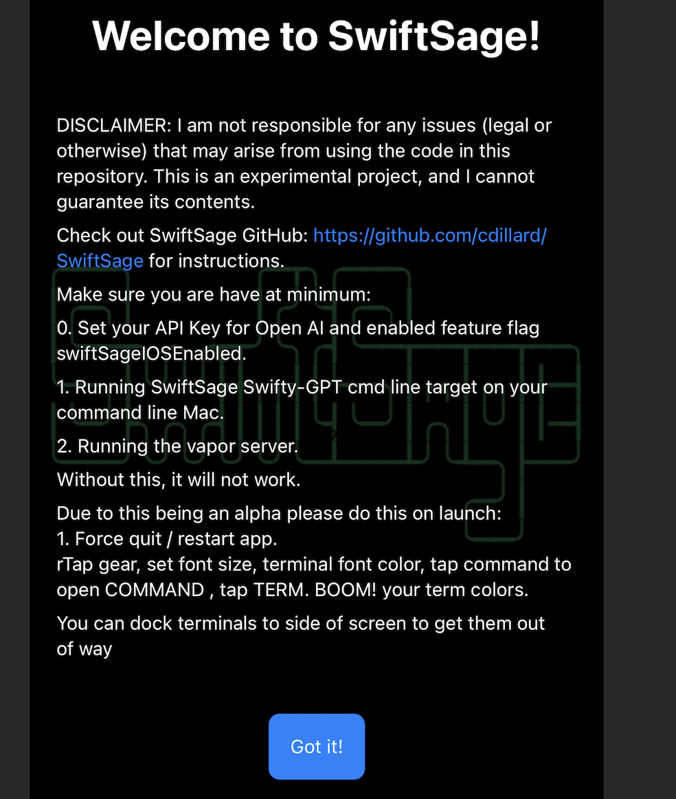
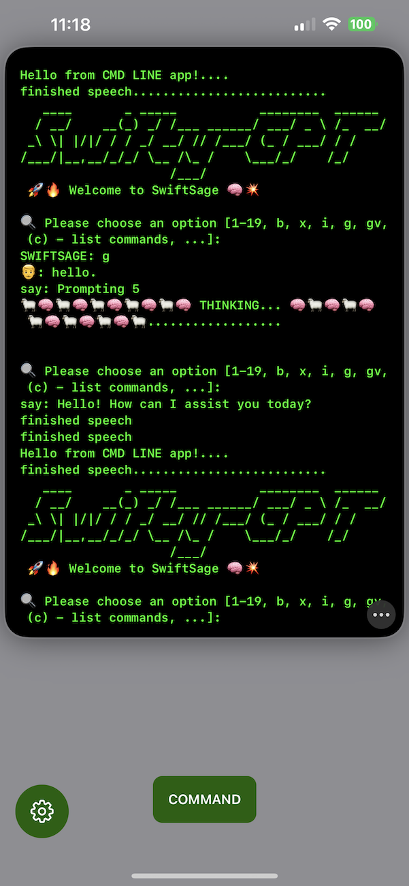
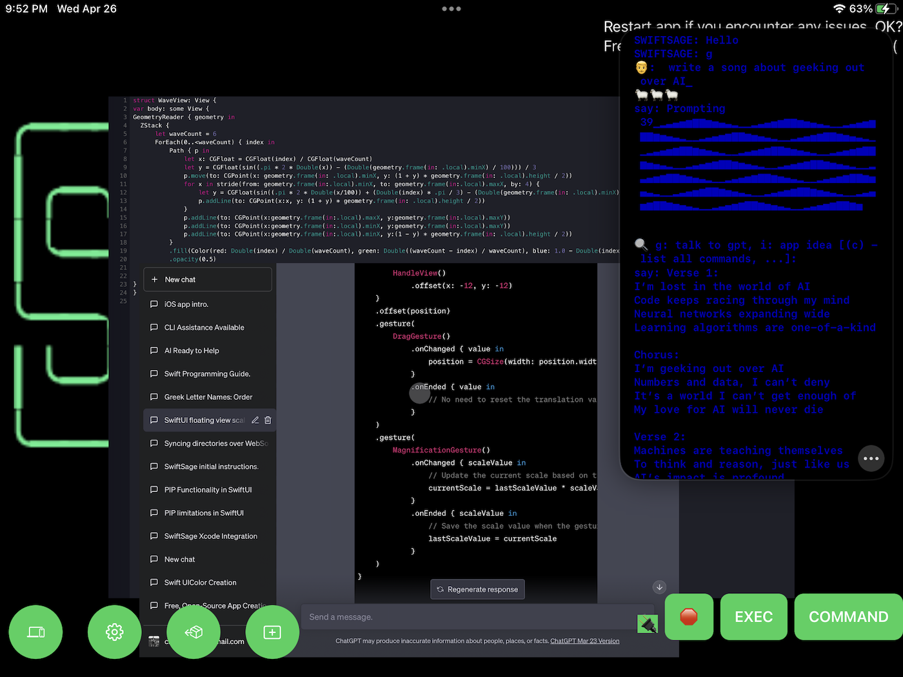
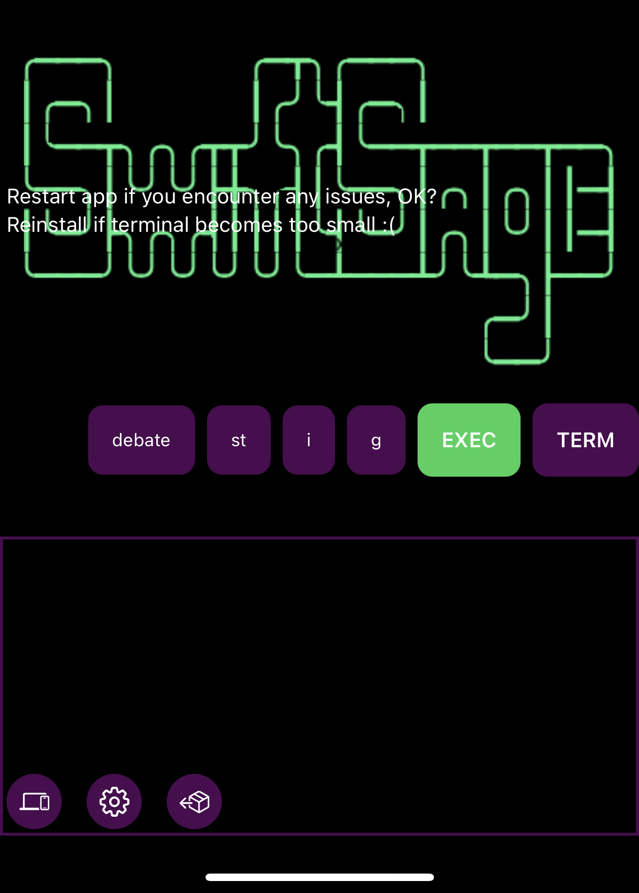
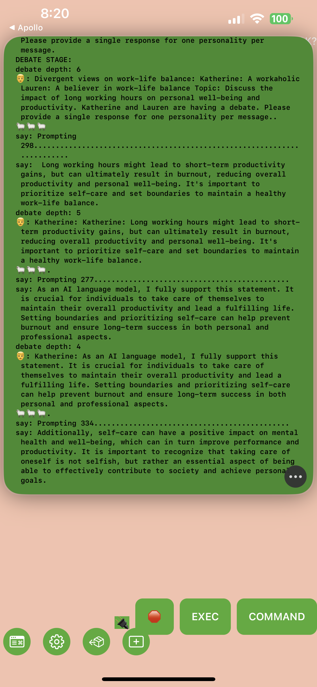

## An OpenAI AI Workspace for Mac OS, iOS, and iPadOS - Open Source in Swift - MIT licensed 



# SwiftSage: The Ultimate AI Integration for Xcode


DISCLAIMER: I am not responsible for any issues (legal or otherwise) that may arise from using the code in this repository. This is an experimental project, and I cannot guarantee its contents as I coded it in my sleep.

SwiftSage is a cutting-edge technology that integrates with Xcode to simplify app development across platforms such as iOS, tvOS, iPadOS, and MacOS. It automates app generation, streamlines coding in Xcode projects, and offers a user-friendly interface. SwiftSage is free, open-source, and MIT licensed on GitHub.

NOTE: ethics exists.
Approach AI and GPT like anything, with respect for balance. It's very addictive.
 >   But we gotta remember, with great power comes great responsibility too
    We need to be careful of the things AGI can do
    We gotta keep an eye on the algorithms we employ
    And ensure they don't become something we cannot enjoy

## Features
SwiftSage provides numerous features to accelerate software development and improve efficiency:
- iOS remote for SwiftSage [IN-PROGRESS]
- Code analysis and optimization
- Error detection and correction [IN-PROGRESS]
- Voice-activated GPT integration
- Real-time code suggestions [IN-PROGRESS]
- Powerful debugging tool [IN-PROGRESS]
- Integration with Apple's built-in text-to-speech software
- Personalized memory storage using a consciousness module [IN-PROGRESS]
- Debate mode: pit the GPT personas against one another with "debate" and "debate your topic"

## Table of Contents
- News, Changelog
- [Getting Started](#getting-started)
- [Installation](#installation)
- [Configuration](#configuration)
- [Troubleshooting](#troubleshooting)
- [Features](#features)
- [Credits](#credits)
- [Contact](#contact)

## News, Changelog

---- 
04-28-2023

DEBATE MODE UPGRADE:

`debates`
`debates subject`

CEREPROC instructions updated, you should be able to use the ones that install into Mac OS voices by default now.
Customize to use cereproc voices in Debates.swift with code like
```
// CEREPROC VOICES SETUP
// Don't check this in -- Chris
//let personalityA = hannahVoice
//let personalityB = carolynVoice
//let personAsName = "Hannah"
//let personBsName = "Sam"
```

---- 
04-26-2023

Files using twostraws excellent Sourceful (see creds)


SwiftSage blurs the line between Playgrounds, Xcode and CLI in a beautiful way.

Webviews for GPT-4!!!!!!!!!!

See Screenshots at bottom

Stay TUNED for multiple TERM windows AND MORE!

----
04-26-2023

iOS input works quite well, give your feedback in Discussions

"debate your topic" mode BETA

Customizable Terminal and app colors (Restart or fresh install app to apply/reset colors for now please.)

CommandButton and wonderful SwiftUI code thanks to GPT-4 and I's coding chemistry.

----
04-24-2023

iOS Swift Sage??? Whattttt??? Yep.

More screenshots at the bottom

----
04-23-2023: DEBATE MODE introduced.

----
04-22-2023

SwiftSage evolves with real-time voice synthesis and Google command integration for enhanced SwiftSage features.

## Getting Started
1. Clone the repository: `git clone https://github.com/cdillard/SwiftSage.git`
2. Navigate to the project directory: `cd SwiftSage`
3. Follow the [Installation](#installation) and [Configuration](#configuration) steps below.

## Installation
### Dependencies
- [Homebrew](https://brew.sh/)
- [Ruby](https://www.ruby-lang.org/en/)
- [Xcode](https://developer.apple.com/xcode/)
- [XcodeGen](https://github.com/yonaskolb/XcodeGen)
- [Xcodeproj](https://github.com/CocoaPods/Xcodeproj)

- [Swift Toolchain Xcode 14.3](https://www.swift.org/download/)

#### Installing Homebrew and Ruby
If you don't have Homebrew and Ruby installed, follow these steps:
1. Install Homebrew by running: `/bin/bash -c "$(curl -fsSL https://raw.githubusercontent.com/Homebrew/install/HEAD/install.sh)"`
2. Install Ruby by running: `brew install ruby`

#### Installing XcodeGen and Xcodeproj
1. Install XcodeGen: `brew install xcodegen`
2. Install Xcodeproj: `gem install xcodeproj`


## SET API KEYS
SET API KEYS: You'll need to track down the following keys to fully experience SwiftSage.

NOTE: NYTIMES,PIXABAY, and GOOGLE are not required (yet) but be sure that the feat flags for those features are disabled in your Config for now if not using please.

```
	<key>GOOGLE_KEY</key>
	<string></string>
	<key>OPEN_AI_KEY</key>
	<string></string>
	<key>GOOGLE_SEARCH_ID</key>
	<string></string>
	<key>NYTIMES_KEY</key>
	<string></string>
	<key>NYTIMES_SECRET</key>
	<string></string>
	<key>PIXABAY_KEY</key>
	<string></string>
```

Check Config.swift for the config.

You can turn on asciiAnimations for fun or turn them off for fun. Your choice.


## Configuration
1. Open `Swifty-GPT.xcworkspace`.
2. Set `OPEN_AI_KEY`.
3. Enjoy!

-More : Move InputText and IdeaText to your `~Documents/SwiftyGPTWorkspace/`, this will be your primary entry point for idea and gpt prompts. The xcode terminal does not support pasting multiple lines of code so this is the best way. Use gptFile, ideaFile to execute.

### Path Configuration
You may need to change the `xcodegenPath` variable depending on your configuration:
- Option 1: `let xcodegenPath = "/Users/$USERNAME/.rbenv/shims/xcodegen"`
- Option 2: `let xcodegenPath = "/opt/homebrew/bin/xcodegen"`

To discover your paths and issues, run:
- `which xcodeproj`
- `which xcodegen`
If you encounter Ruby errors, follow the steps here: [StackOverflow Solution](https://stackoverflow.com/a/31250347)

### OCR Models (not needed currently)
Download the necessary OCR models and place them in the corresponding directories:
1. [tessdata_fast](https://github.com/tesseract-ocr/tessdata_fast): Place the contents in `../SwiftyGPTWorkspace/tessdata_fast-main`.
2. [tessdata](https://github.com/tesseract-ocr/tessdata)
3. [tessdata_best](https://github.com/tesseract-ocr/tessdata_best)

### Voice Command
Download the desired datasets from [Hugging Face](https://huggingface.co/ggerganov/whisper.cpp/tree/main) and place them in `Swifty-GPT/Swifty-GPT/Model`:
- ggml-large.bin
- ggml-medium.en.bin
- ggml-large-v1.bin
- ggml-base.en.bin
- ggml-small.en.bn

---
## MAKING BUILT IN MAC OS VOICES THE BEST THEY CAN BE  (Not needed unless you want decent sounding voices)

If you would not like to hear ANYTHING from this tool please set `let voiceOutputEnabled = false`

-MAKE SURE YOU HAVE ALL POSSIBLE MAC OS VOICES INSTALLED BY GOING TO Settings -> Voice -> Spoken Content and downloading them all.

WANT A BETTER AND MORE REALISTIC SOUNDING VOICE????
```
// What YOU don't like the goofy robotic voices built in to Mac OS????
// DISABLED BY DEFAULT: SEE README AND https://www.cereproc.com
```
Just install the voices you want to Mac OS TTS, once they are installed check out their identifier in Sw-S with (5) and add them to the config.swift.

FIND/BUY/INSTALL THE VOICE YOU FANCY.
https://www.cereproc.com


## UNDERSTANDING THE SWIFT SAGE COMPONENTS!


---
## SWIFT SAGE IOS INSTRUCTIONS: (Not needed unless you want to use SwiftSage on iOS/iPadOS devices)

DO NOT use wireless debuggin, it won't work due to websockety conflict

UPDATE the feat flag
`let swiftSageIOSEnabled = true`

If you have issues: `rm -rf WebSocketServer/.build`

TURN OFF YOUR FIREWALLS ON ALL USED DEVICES

1. Install Vapor: `brew install vapor`


USE THIS COMMAND TO RUN VAPOR SERVER

```
cd  WebSocketServer
rm -rf .build
vapor build
vapor run
```

## MAC SAGE INSTRUCTIONS:
TBD


## Troubleshooting

### Xcode build
`tessdata_fast-main` should be deleted from the Xcode project. It will be added to the SwiftyGPTWorkspace folder in your Documents dir.

---

### Microphone Access

NOTE: To enable the mic head to Config.swift and turn on `let voiceInputEnabled = true`


If you experience issues with microphone access/MIC POPUP, follow these steps:
1. Head to the Swifty-GPT folder and run the following command with your Apple Development account to stop the Mic popup:
Head to the Swifty-GPT folder and run this on the entitlements fil with your Apple Development account. This will stop the Mic POPUP.
 `codesign --entitlements Swifty-GPT.entitlements --force --sign "Apple Development: yourdevemail@gmail.com (YOUTEAXZM)" ../Xcode/DerivedData/Swifty-GPT-fsilcclqupwxmwfxejzmbhescakg/Build/Products/Release/Swifty-GPT`


If you see dialogs such as "would like to use your Microphone" or "Would like to send events to other applications," please accept them.

---
Sometimes GPT will refuse to make apps....
```
Response non nil, another generation...
🤖: Sorry, as an AI language model, I am not able to develop an iOS app. My capabilities are limited to generating human-like text based on the given prompts.
found [] names
found [] commands
📁 found = 0
No names found... failing..
(Function)
```
If this happens just try again and it _usually_ clears right up.


---
## Credits
- [SwiftWhisper](https://github.com/exPHAT/SwiftWhisper)
- [SwiftyTesseract](https://github.com/SwiftyTesseract/SwiftyTesseract)
- [OpenAI GPT-4, GPT-3.5 turbo APIs](https://www.openai.com)
- [AudioKit](https://github.com/AudioKit/AudioKit)
- [SwiftSoup](https://github.com/scinfu/SwiftSoup)
- [SwiftNLC](https://github.com/JacopoMangiavacchi/SwiftNLC)
- [SourceKitten](https://github.com/jpsim/SourceKitten)
- [MultiPeerKit](https://github.com/insidegui/MultiPeerKit)
- [LocalConsole](https://github.com/duraidabdul/LocalConsole)
- [Starscream](https://github.com/daltoniam/Starscream)
- [Vapor](https://github.com/vapor/vapor)
- [LocalConsole](https://github.com/duraidabdul/LocalConsole)
- [Blackhole](https://github.com/ExistentialAudio/BlackHole)
- [https://github.com/louisdh/source-editor]
- [https://github.com/louisdh/savannakit]
- [https://github.com/twostraws/Sourceful]
---
Thanks to Mike Bruin for keeping the Plist safe.

---
## Contact
Created by: Chris Dillard (c_h_r_i_s_b_d_i_l_l_a_r_d_@_g_m_a_i_l.com)

- With a little help from my GPT🤖. Thank you, OpenAI!
---








---
Unlocking the Power of the Future: Exploring the Intersection of Mobile and Artificial General Intelligence Programming. In this project, expert in the field of mobile technology and AGI programming discusses the ways in which these two fields are converging and changing the way we interact with technology. From the impact of machine learning on mobile apps to the future of robotics and automation, this project explores the cutting edge of innovation and speculates on what the future may hold. Join us as we delve into the possibilities of a world transformed by the power of technology.