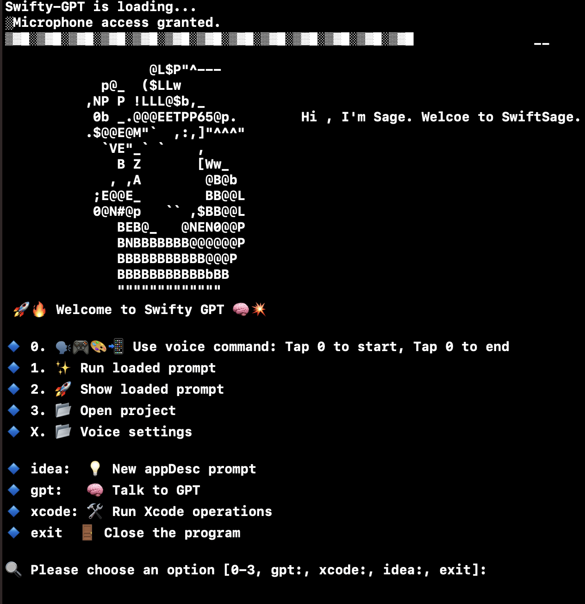

## Created by: Chris Dillard (c_h_r_i_s_b_d_i_l_l_a_r_d_@_g_m_a_i_l.com)
With a little help from my GPT. Thank you Open AI.

# Swifty-GPT is a great tool for creating apps on Apple devices like iPhones, Macs, and more. It helps with everything in Xcode, from starting projects to fixing bugs. Plus, it can do a lot of the work for you, like adding the right code, so you can focus on making your app amazing. Whether you're developing a fun game or a professional business app, Swifty-GPT makes the whole process smoother and easier in Xcode.

# Instructions: Set OPEN_AI_KEY. Have fun!

Swifty-GPT is not just for game development. Its powerful capabilities make it a versatile tool that can be used for any business application, including realtor apps and e-commerce apps. Swifty-GPT automates the process of app development, creating high-quality iOS applications with ease. It can import the necessary libraries and work with all Apple APIs, making it the ideal tool for business use cases. With Swifty-GPT, you can create iOS applications for your business in a fraction of the time, without sacrificing quality or functionality.

# Voice Command

Pick your voice after trying them out with voice_test `swift voice_test.swift` inside Swifty-GPT folder.

For Voice Command you must download dataset you desire to use from https://huggingface.co/ggerganov/whisper.cpp/tree/main.
youll need
 ggml-large.bin,
 ggml-medium.en.bin,
 ggml-large-v1.bin
